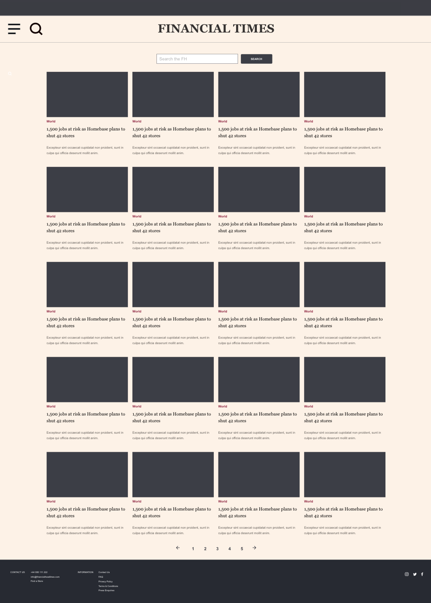

# Headlines

A web application to display the latest news headlines.

### Quickstart:
#### How to install the code:
1. Clone this project ```git clone https://github.com/CLTPayne/headlines-app.git```
2. Change into the directory ```cd headlines-app```
3. Run ```npm install``` to add module dependencies

#### How to use the website:
1. Launch development server with ```npm start``` and visit ```localhost:3000```
2. When finished with the application, close the server with ```^c```

#### How to use the website:
1. Feature tests via Cypress CLI tool:<br/>
  a. Ensure development server is running with ```npm start```<br/>
  b. ```$(npm bin)/cypress run --browser chrome```<br/>
2. Unit tests via Jasmine in the browser with ```open SpecRunner.html```

#### Test coverage:
1. Cypress final test suite for feature tests:


2. Jest final test coverage:


### User Stories:
```
As an avid news follower
So that I know what is going on in the world  
I want to see a list the latest news headlines

As an avid news follower
So that have the information I need
I want to see headlines relating to a specific search word

As an avid news follower
So that I'm not overwhelmed with a never ending stream of content
I want to see 20 headlines per page

As an avid news follower on-the-go
So that I have information on demand
I want to have a great experience on mobile devices
```

### Mockup:
Web (full screen) optimised:


Mobile optimised:
[Interactive version](https://xd.adobe.com/view/0ca788f3-1297-493d-68fa-76e119915efd-7a96/)

### Diagram:


### Code Style:
JavaScript and node.js

### Code Example:
```
```

### Approach to solving the challenge:
1. Investigate the FT Developer APIs using Postman to test a range of endpoints and see the full scope of data available via the various aspects and curations.
2. Explore feature test options (selected Cypress over Nightwatch as have used it previously.
3. Focused on the BDD cycle so drafted user stories as per the project requirements.
4. Set up Express app to serve the application.
5. Research the FT style and layout and mockup design to fit the user stories - used Adobe XD.
6. Create basic HTML page to fit the mockup and user stories, and served via the Express.
7. Explore template engine options for node.js. Not previously used a template engine so decided on pug due to popularity and level of documentation.


### Status at the point of push:
1.

### Intended next steps:
1.
