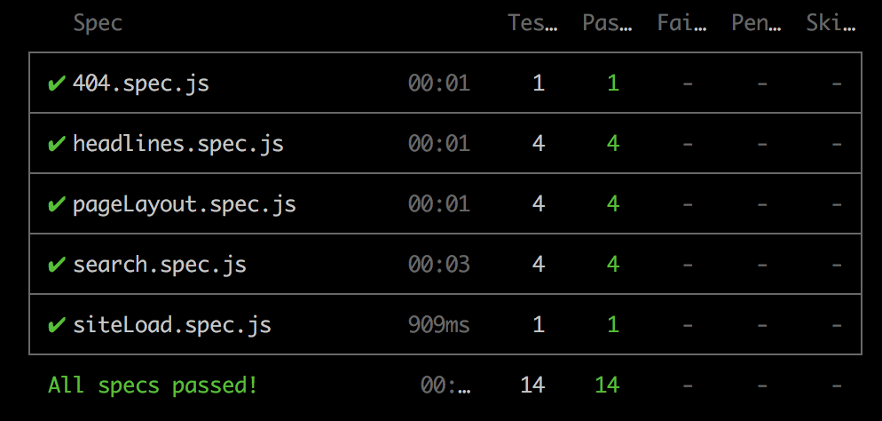
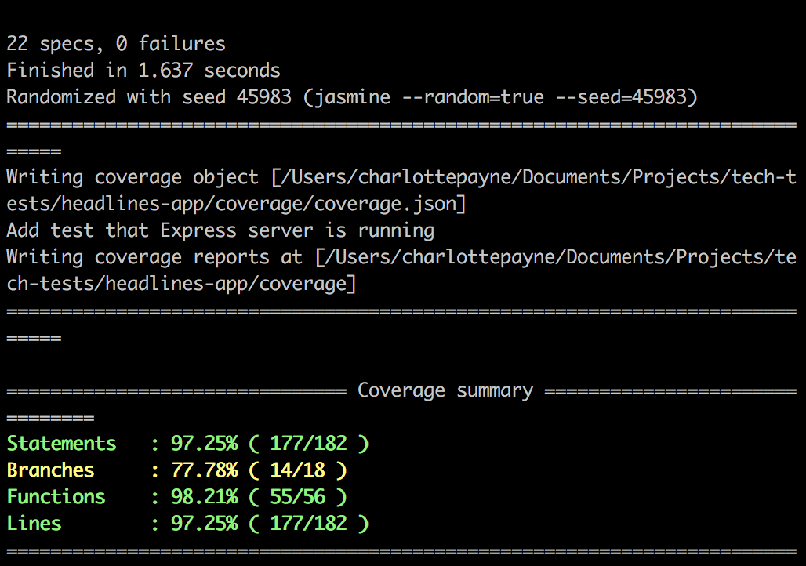
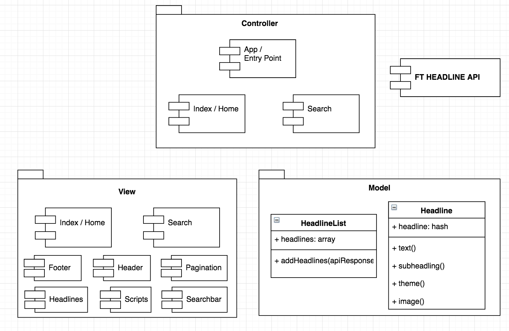
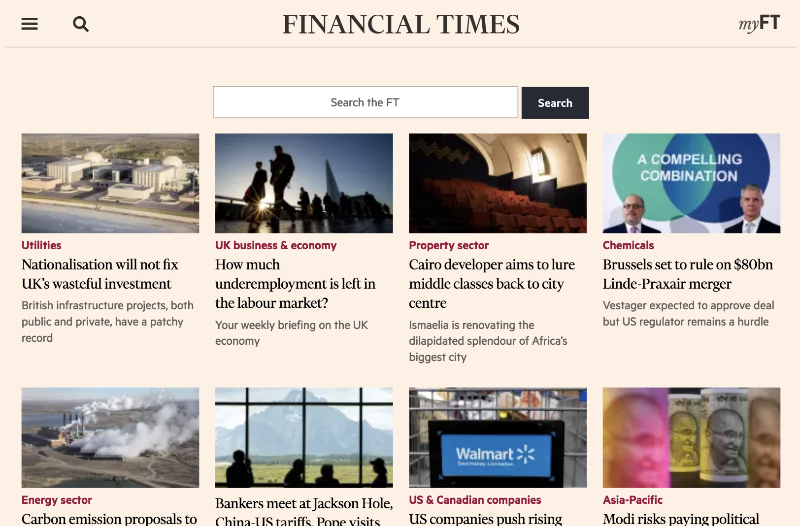
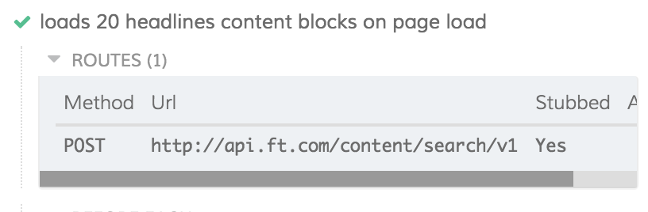

# Headlines

A web application to display the latest news headlines.

Live site - https://financial-headlines.herokuapp.com/

### Quickstart:
#### How to install the code:
1. Clone this project ```git clone https://github.com/CLTPayne/headlines-app.git```
2. Change into the directory ```cd headlines-app```
3. Run ```npm install``` to add module dependencies

#### How to use the website locally:
1. Launch development server with ```npm start``` and visit ```localhost:3000```
2. When finished with the application, close the server with ```^c```

#### How to run the tests:
1. Feature tests via Cypress CLI tool:<br/>
  a. Ensure development server is running with ```npm start```<br/>
  b. ```$(npm bin)/cypress run --browser chrome```<br/>
2. Unit tests via Jasmine with Istanbul for coverage ```npm test```

#### Test coverage:
1. Cypress final test suite for feature tests:


2. Jasmine final unit test coverage:
  

### User Stories:
```
As an avid news follower
So that I know what is going on in the world  
I want to see a list the latest news headlines

As an avid news follower
So that have the information I need
I want to see headlines relating to a specific search word

As an avid news follower
So that I'm not overwhelmed with a never ending stream of content
I want to see 20 headlines per page

As an avid news follower on-the-go
So that I have information on demand
I want to have a great experience on mobile devices
```

### Mockup:
Web (full screen) optimised:


Mobile optimised:
[Interactive version](https://xd.adobe.com/view/0ca788f3-1297-493d-68fa-76e119915efd-7a96/)

### Diagram:


### Code Style:
JavaScript and node.js

### Code Example:
```
function Headline(headline) {
  this.headline = headline;
};

Headline.prototype.text = function() {
  return this.headline.title.title;
};

Headline.prototype.subheading = function() {
  return this.headline.editorial.subheading;
};
```

### Approach to solving the challenge:
1. Investigate the FT Developer APIs using Postman to test a range of endpoints and see the full scope of data available via the various aspects and curations.
2. Explore feature test options and selected Cypress over Nightwatch as have used it previously. Deeper dive into the pros and cons of stubbing network requests (as this is crucial to the page content). Decided to stub as they are faster and the FT headlines library is external and assumed to be reliably tested, Cypress also advises that stubs are perfect for JSON APIs.
3. Research server side rendering (vs client side which have previously used)- good for SEO purposes as search engines can see a rendered page without having to run JavaScript.
4. Focused on the BDD cycle so drafted user stories as per the project requirements.
5. Set up Express app to serve the application.
6. Research the FT style and layout and created a mockup design to fit the user stories using Adobe XD (as shown above).
7. Create basic HTML page to fit the mockup and user stories, and served via the Express app.
8. Decide on MVC model in order to keep code as clean as possible and easier to test in isolation. Also keep presentation logic separate from business logic.
9. Explore template engine options for node.js. Not previously used a node template engine so reviewed pug (due to recommendation in Express docs), mustache as understand it is especially suited for manipulating JSON in Javascript applications, and ejs. Decided on ejs due to considerably wider usage (2.1m weekly npm downloads) and volume of documentation. Also looked at templating engines for CSS (e.g. SASS) as this would allow more advanced syntax for defining the CSS, and then compile the definition into standard CSS for browsers to use. This project is small so ordinary CSS is sufficient.
10. Explore FT Origami component library and understand how best to bundle the code for serving. Potentially use: colours, fonts, grid (as includes responsive features), footer, buttons, header, forms, social icons, image-service (for resizing images. Would like to manually build but will revisit if time.
11. Set up basic ejs framework with range of origami components and basic css styling to check functionality. Split elements out into partial views that can be reused and incorporated in a page as needed (inspired by the logic of libraries like React that give you components as reusable building blocks).
12. Install eslint and run with ```./node_modules/.bin/eslint [file name]```.
13. Install Jasmine browser based test runner for unit tests.
14. TDD business logic for the headlines and list of headlines models.
15. Source suitable dependencies for server based external API calls - chose [body-parser](https://www.npmjs.com/package/body-parser) for body parsing middleware as works with JSON and urlencoded bodies and well maintained (last commit was 10 days ago) and [request](https://github.com/request/request#readme) due to it's compatibility with form data and JSON, plus well maintained (last commit was 7 days ago 12.5 million weekly downloads.
16. Add dependency for using variables listed in .env files in process.env - chose [dotenv](https://github.com/motdotla/dotenv#readme) as seems to be most widely used and recommended with node. It also has zero dependencies.
17. Research testing of Express routes with Jasmine. Decide to switch test suite from being run in the browser to CLI. This is to enable Jasmine (with the support of SuperTest for HTTP assertions) to test the Express controllers in project MVC design.  
18. Although would often not test external code base, as the application 100% relies on the FT API to successfully send headline data and deliver on the user requirements, tested the index.js route's external API call.
19. Render API response info via views. Reviewed image [accessibility](https://www.w3.org/WAI/tutorials/images/) and classified these as decorative because the heading, theme and subheading is already provided so no alt text needed.  
20. Add styling and finalise origami component structure for the first feature (loading top headlines). Page is responsively optimised:<br/>
  a. Grid view adjusts from four columns, to two columns, to a single column for mobile devices. <br/>
  b. Reduced footer for iPad mini and smaller (as full footer includes a lot of extra links and reduces the page balance) so less core information is hidden. <br/>
  c. Reduce the pagination controls to list just four numbered buttons and the arrow so fits to smallest mobile screens. (Fifth numbered button is hidden). <br/>
  d. Images are slightly blurred in some situations but this is due to the free FT API providing limited thumbnails sizes and would be adjusted with full API access and image access.
21. Install sass-lint and run with ```./node_modules/.bin/sass-lint -c .sasslintrc './public/stylesheets/style.css' -v -q```. Looked for an FT configuration template but none found so used a general best practise file.
22. Attempt to add cut the mustard test to check page loading environment and select core or enhanced version as best suited. However project is server rendered via views so not sure how to separate out the enhanced elements as a separate script. Will revisit if have time.
23. Added nodemon for the development process to manage the server connection. This package watches for changes in the code base and restarts the server when a change is identified. Running the app with ```nodemon app.js```
24. Now have the minimum viable version of the application so deploying now to avoid building more issues trying to deploy the final product. Prepare application for production:<br/>
  a. Installed (helmet)[https://www.npmjs.com/package/helmet] middleware to help protect the application from some web vulnerabilities.<br/>
  b. Installed (compression)[https://www.npmjs.com/package/compression] middleware for compress the http response that is sent to the client.<br/>
  c. Add engines info to package JSON.<br/>
  d. Set up the repository and update going forward with ```git push heroku master```
25. Add simple 404 error message, with margins responding to screen size.
26. Add search routing and functionality complete the search feature. Double checked FT API search endpoints in Postman to find that the query string is not case sensitive and functions with spaces.
27. Test coverage - if I was to restart the project I would use Jest rather than Jasmine as there is no built in test coverage tool. Researching options for this and [Istanbul](https://www.npmjs.com/package/istanbul) seems to be the most trusted option with nearly 1M downloads a week and lots of users documenting it positively. Run test coverage with: ```istanbul cover --include-all-sources npm test```
28. Review accessibility of the site. Research and improve use of ARIA to try to describe all labels, roles and states. Focused on using semantic HTML tags.
29. As per BDD cycle, revisit feature tests and adjust identifying ids and text to reflect current project status in response to user stories.

### Status at the point of push:
1. Search bar is fully functional, allows repeated searching
2. Pages are responsive
3. Part way through cut the mustard test / implementing a core vs enhanced version of the site
4. Page loads just 20 results but no pagination.

Home Page:


Mobile:


### Intended next steps:
1. Implement pagination.
1. Refactor API call logic out of controllers.
2. Improve Cypress feature tests to use the stubbed API call data. API call was successfully stubbed with custom command useMocks() however seems to be the structure of the real server side API call that prevents Cypress loading the successfully stubbed headlines the page:

3. Use the lifecyle info for each news story headline to display if a story was published in the last 12 hours - to give the user info as to whether a story is breaking news.
4. Switch the Origami components to using the build service to manual build so as to have more control over the application and rendering.
5. Update syntax to es6. Due to the timeline, chose es5 for this task due to greater familiarity.
6. If a real development scenario, would switch FT headlines API for the full API for full access to images and fix blurring at some sizes.
7. Provide offline functionality. Did some research but did not have time to implement. This FT Labs [article](https://labs.ft.com/2012/08/basic-offline-html5-web-app/) was very interesting as a starting point. Would need a script listen for connection and download the latest headlines when online
8. If a real scenario app would look at adjusting search results to take relevance into account (not just recency).
